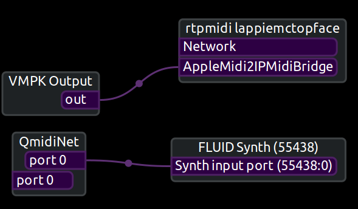

copyrights
----------
mdns_rtpmidi.hpp and mdns_rtpmidi.cpp are from https://github.com/davidmoreno/rtpmidid

building
--------
Install rtpmidid (especially its 'dev' library) from:
https://github.com/davidmoreno/rtpmidid

Then:

* make build
* cd build
* cmake ..
* make

usage
-----
* a2im -h

to see a list of options.

(c) 2021 by Folkert van Heusden <mail@vanheusden.com>
Licensed under GPL v3.0.
